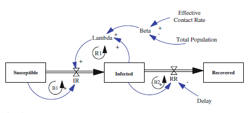

```{r setup, include=FALSE}
knitr::opts_chunk$set(echo = TRUE)
library(deSolve)
library(dplyr)
library(DiagrammeR)
library(ggplot2)
require(gridExtra)
library(scales)
library(stringr)
library(knitr)
library(testthat)
library(FME)
```

This document introduces system dynamics, a form of simulation modelling for operations research, and includes information about how to use the R programming language to implement models. Code used to produce examples is embedded in the page and its visibility can be toggled.

## Simulation modelling

Simulation models are simplified versions of the real world that we can use to predict system performance, comparing the effects of alternative system designs, or determine the effects of alternative policies on performance or, in the words of Pidd (1996) models are:

> "an external and explicit representation of part of reality as seen by the people who wish to use that model to understand, to change, to manage and to control that part of reality."

This allows us to explore how changes to one part of a system may play out in the rest of the system in a rationale and repeatable way, and without having to make to change to find out what may happen.

Models don't have to be perfect representation of reality to gain insights, and often a very simple model can produce sufficient information to direct action. However, many of the systems we may be interested in modelling are highly complex and

> You cannot meddle with one part of a complex system from the outside without the almost certain risk of setting off disastrous events that you hadn't counted on in other remote parts. If you want to fix something you are obliged to first understand ... the whole system." (Thomas, 1974)

Things like dependencies, non-linearities, feedback loops and time delays can make constructing a simple yet effective model very difficult, especially when doing so without a formal modelling framework. It is therefore often advisable to build models iteratively, only adding components where they add value. There are three common methods used for simulation modelling; agent based modelling, discrete event simulation, and system dynamics. System dynamics will be out focus but it is useful to understand how the methods relate to each other.

### Agent based modelling

As opposed to system dynamics ABM is a bottom-up approach where individuals (or agents) are allowed to interact with each other autonomously, governed by rules and motivations, with the system emerging from the results of these interactions rather than being formalised in the model itself. This makes ABM very suitable to problems where understanding how individuals behaviours affect systems. ABM is a newer approach

### Discrete event simulation

Discrete event simulation is a method which focuses on the concept of entities queuing for a series of ordered events, with each event changing the system in some way (e.g., a conveyor belt moving entities through a well-defined system). This technique is ideal for modelling smaller systems where more detail is required (e.g., patients moving through a hospital). In the below example [Huang et al. (2019)](https://www.frontiersin.org/articles/10.3389/fneur.2019.00653/full) explore how to optimise resources to undertake the time critical removal of clots from stroke patients. We can see that patients arrive, forming a queue for resources before being passed into another queue for their next resource. Repeated runs of the model produce slightly different results which can then be analysed to obtain the characteristics of the system.

Examples of DES packages include `simmer` and `PathSimR`.

[](https://www.frontiersin.org/files/Articles/463210/fneur-10-00653-HTML/image_m/fneur-10-00653-g001.jpg)

### System dynamics

System dynamics by comparison is much more abstract, focusing on continuous flows around a, often large, system rather than the details of individuals or events within the system. Unlike DES, system dynamics treats entities as a fluid controlled by continuous in- and outflows. The top-down methodology of SD is ideal for strategic modelling of the kind of large, interrelated systems common in health care and public health where interventions can have far reaching and unpredictable effects and can take long periods of time to embed.

### Summary

In general, if modelling a small, relatively conceptually simple problem over a short period of time with an aim to improve processes DES may be preferred. If modelling large, complex systems, over a long time period where relationships between components of the system and policy changes are of primary interest system dynamics may be preferred. If the aim is to understand how individual behaviour affects systems, especially where behaviour differs across individuals, agent based modelling may be preferred.

+------------------------------------+---------------------------------+--------------------------------------------------+
|                                    | Discrete event simulation       | System Dynamics                                  |
+====================================+=================================+==================================================+
| Scope                              | Operational, tactical           | Strategic                                        |
+------------------------------------+---------------------------------+--------------------------------------------------+
| Importance of variability          | High                            | Low                                              |
+------------------------------------+---------------------------------+--------------------------------------------------+
| Importance of tracking individuals | High                            | Low                                              |
+------------------------------------+---------------------------------+--------------------------------------------------+
| Number of entities                 | Small                           | Large                                            |
+------------------------------------+---------------------------------+--------------------------------------------------+
| Control                            | Holding (queues)                | Rates (flows)                                    |
+------------------------------------+---------------------------------+--------------------------------------------------+
| Relative timescale                 | Short                           | Long                                             |
+------------------------------------+---------------------------------+--------------------------------------------------+
| Purpose                            | Decisions: optimisation,\       | Policy making: gaining understanding             |
|                                    | prediction and comparison       |                                                  |
+------------------------------------+---------------------------------+--------------------------------------------------+
| Reproducibility                    | Stochastic (will vary each run) | Deterministic (usually returns the same results) |
+------------------------------------+---------------------------------+--------------------------------------------------+

: Discrete event simulation and system dynamics. Adapted from [Brailsforth and Hilton (2001)](https://core.ac.uk/download/pdf/30381.pdf)

## Why use R

There are several products (e.g., Vensim, Stella, Insight Maker) that are designed to make building system dynamics models simple. Equally tools such as Excel can be used when models are simple as in the above example. If these exist why would we use R to make models?

With these proprietary programmes there are issues with adopting such as cost, whether they can be installed, and the specialised knowledge required to use them. More importantly R has a number of advantages including its powerful visualisation capability, its shareability and openness both in terms of code and finished models, and finally its ability to be used for many other forms of analysis mean it has a large and diverse user base with prior experience of developing in R. For instance, we can make dashboards that allow the user to modify the model through a web browser and we can pass the results of analysis into models automatically (e.g., we could feed actual case numbers into the model above automatically on a daily basis to update the model).

## System dynamics components (1)

While system dynamics can sound daunting, it is built from relatively simple concepts. This section introduces some of the building blocks of system dynamics modelling. Later more advanced components will be introduced.

### Stocks and flows

These are the basic building blocks of a system dynamics models. A stock represents the quantity of a given item at a value in time, for instance the number of patients in hospital on a given day, while a flow is a measure of input or output between stocks, for example the number of admissions or discharges to hospital in a given period. Flows can be thought of as a rate such (e.g., the number of infections occurring per year) while stocks are units (e.g., people, money, hospital beds). Stocks can only change through the flows associated with them.

### Auxiliary variables

It is likely that additional variables will be required that may not be stocks or flows, often as a way to limit model complexity. For instance, we may want to define a target or threshold which a stock or flow cannot exceed either as a hard cap or as a fraction of another variable (e.g., to allow the inflow of stock to be proportional to the value of the stock). These are referred to as auxiliary variables.

### Feedback loops

Feedback loops are a critical element of system dynamics modelling and refer to circular causal links where the value of a stock influences a flow which in turns changes the stock. Feedback loops are common in systems, for instance if a hospital is full (no spare stock of beds), the inflow of patients admitted will decrease. Because the outflow of patients discharged continues the availability of stock will begin to increase.

A stock can influence a flow directly as in the hospital example, but it can also be modified though intermediate auxiliary variables, for instance we may have a target that the hospital should keep at 85% occupancy and if this is breached the outflow of patients through discharge should be increased, allowing the inflow to continue unabated.

## Example: heating systems

A classic example of system dynamics is a household heating system and demonstrates each of these core components. In the below diagram we can see the parts of the model:

")

A [Target Temperature]{.ul} is set (this is an example of an auxiliary variable set outside of the model). An [Adjustment]{.ul} process is undertaken by the heating system. This [Adjustment]{.ul} process is a feedback loop that measures the [Room Temperature]{.ul} (a stock) and, if this is below the [Target Temperature]{.ul}, an amount of heat is added to the room through the [Heat Added]{.ul} flow to the [Room Temperature]{.ul} stock until the [Target Temperature]{.ul} is met. At the same there is an outflow of [Heat Lost]{.ul} leaving the room which reduces the [Room Temperature]{.ul}.

In this case the system is goal seeking because as [Room Temperature]{.ul} decreases, [Heat Added]{.ul} is increased to meet a target/goal, increasing [Room Temperature]{.ul}, and decreasing [Heat Added]{.ul}. Because the stock has moved in the opposite direction this is classed as a negative feedback loop.

Note in the diagram two cloud-like symbols. These represent the boundaries of the model termed source and sink for the input and output respectively. In this case we have an effectively unlimited supply of material with the [Heat Added]{.ul} flow can add to the [Room Temperature]{.ul} and as modellers the decision has been made to exclude this section of reality in order to simply the model. Similarly, we do not model where heat has gone once it leaves the room.

## System dynamics in R: packages

### deSolve

As discussed above integration is one of the core components of system dynamics modelling. The `deSolve` package provides a way to calculate ordinary differential equations (ODE) in R. To use the `ode` function in `deSolve` we pass variables containing the stocks, times to simulate over, auxiliary variables, and the model equations, as well as an integration method to use. Running a model would therefore look something like:

```{r, eval = FALSE, class.source = 'fold-show'}
data.frame(ode(y = stocks,
               times = simulationtime,
               func = model,
               parms = auxiliaries,
               method = "euler"))
```

The model should be defined in a function which takes three parameters: the current simulation time, a vector of the current stocks, and a vector of the model parameters. These are wrapped in `with` and `as.list` functions to making accessing the parameters easier. The model function returns a list where the first elements is a vector containing the net flows in and out of stocks (referred to as derivatives, see the [Integration] section). The order these are returned in must match the order they are defined in the stock. In this case we also return a number of additional variables to help understand the model and we rename them for ease of use; these are completely optional.

```{r, eval = FALSE, class.source = 'fold-show'}
model <- function(time, stocks, auxiliaries){
  
  with(as.list(c(stocks, auxiliaries)),{
    
    # Auxiliaries
    aEffectiveContactRate <- aContactRate * aInfectivity
    # number of infections created by each infectious person
    
    aBeta <- aEffectiveContactRate / aTotalPopulation
    # per capita transmission rate based on effective contacts per person/step 
    aLambda <- aBeta * sInfected
    # infection rate based on beta and number currently infected
    
    # Flows
    fIR <- sSusceptible * aLambda
    # incidence rate based on the number susceptible and lambda
    
    fRR <- sInfected / aDelay
    # recovery rate based on number infected and recovery delay
    
    # Integral of Stocks
    d_sSusceptible_dt <- -fIR # remove the newly infected from stock
    d_sInfected_dt <- fIR - fRR # get the new number currently infected
    d_sRecovered_dt <- fRR # move those no longer infected to recovered
    
    # Return a list of the important model values
    # The order of the integrals of the stock must match the stock dataframe
    return(list(c(d_sSusceptible_dt,
                  d_sInfected_dt,
                  d_sRecovered_dt),
                IR = fIR,
                RR = fRR,
                Lambda = aLambda,
                CE = aEffectiveContactRate,
                RecDelay = aDelay))
    
  }
```

### DiagrammeR

There are a number of diagram creation packages in R including `diagrammeR`, `ggdag`, `diagram`, and `nomnoml` and tools such as Visio can be used outside of R and of course technically a model can be built without a diagram, it just becomes harder to understand. For this tutorial we'll use the `diagrammeR` package as it is flexible and relatively easy to use. Guidance on using `diagrammeR` can be found [here](https://rich-iannone.github.io/DiagrammeR/). Several methods are provided to construct diagrams including piping, dataframes, and create a DOT object (a type of code which creates diagrams). For the purposes of this we will use the DOT language because it allows an (arguably) more logical layout and can allow better integration with the model itself. It can take some playing around to make a nice-looking output.

### Other packages

A number of other R packages can optionally be used to make model building easier as well as to enhance the use of the model. Packages within the tidyverse (e.g., `dplyr`, `tidyr`) can be used to manipulate data, `ggplot`, `plotly`, and `echarts4r` can be used visualise results with the latter two supporting interactive visuals. Finally `Shiny` can be used to create interactive dashboards allowing users vary model parameters without writing code. Used together this can be immensely powerful in helping practically develop and use models.

There are a number of packages which can be used to run models developed in Vensim, Stella and other software within R or Python. Examples of these are including a separate script. These have the benefit of being able to develop the model without having to writing the full model as code (which can be tricky) whilst still allowing many of the benefits of using a language like R. If the model was developed in Stella the `readsdr` package can be used (this can even generate diagrams in R with little code) and if using Vensim `pysd2r` can be used (note this package also requires Python be installed, more features are available in the base Python package `pysd` though some advanced features of Vensim such as subscripts may not be supported). More details are given in [Appendix: Using other SD software with R].

## Example: infectious disease

To illustrate a system dynamics model in R we will build a model showing how an infectious disease may spread through a population. The first step is to consider what we want our variables to be. In this case we are interested in the following stocks, flows, and auxiliaries:

#### Stocks

The starting value of stocks is defined at the start of the model and then varies based on the effects of the flows. In this case we need:

-   The number of people in the population who are susceptible to the disease at the start of the simulation (**Susceptible**).
-   The number of people in the population with the disease at the start of the simulation (**Infected**)
-   The number of people in the population who have already recovered from the disease at the start of the simulation (**Removed**)

#### Auxiliaries

The value of auxiliaries can be set without dependency on the value of other variables (in which case it is termed exogenous because it sits outside the model) or can depend on other variables within the model (and is therefore endogenous). In this case we need:

-   The number of contacts between people that lead to passing the disease to another person (**Effective Contact Rate**). In this case to reduce complexity this will be set outside the model.
-   The **Total Population** is a summation of the Susceptible, Infected, and Removed population. In this case to reduce complexity this will be set outside the model.
-   The per capita transmission rate (**Beta**) of disease from infected people to susceptible people is dependent on the number of effective contacts and the total population.
-   The infection rate (**Lambda**) depends on Beta and the number of people currently infected.
-   The **Delay** between people being infected and being removed from the infected stock from the disease. In our simplified model we will assume that someone is infectious the entire time they are infected. In this case to reduce complexity Delay will be set outside the model.

#### Flows

While stocks and auxiliary variables are defined as numbers, flows are defined as equations. In this case we need:

-   The number of people newly infected is the **Incidence Rate**. This is an outflow from the Susceptible stock and an inflow to the Infected stock.
-   The number of people removed is the **Recovery Rate**. This is an outflow from the Infected stock and an inflow to the Removed stock.

This is clearly a highly simplified model of disease transmission, not accounting for factors such as difference in sub-populations and changes in policy and behaviour over time, but the first step in making a complex model is to make a simple model. We'll do this later, but it is always worth considering whether it is worth adding complexity to a model. Complexity will make models harder to understand and maintain and may not provide additional insight into the problem at hand and it is often the case that a relatively simple model provides sufficient understanding to make an informed decision.

### Model diagram

The next step is to visualisation our model as a diagram. This both helps with communication to others but also allows us to explore the causal loops and make sure our model makes sense. While some specialised software such as Vensim and Stella are able to create both visuals and models at the same time because R is general purpose these steps must be undertaken separately (though we can provide some linkage which we'll cover later).

A typical system dynamics diagram looks like:

{width="600"}

We'll go over exactly what each bit of the visual shows later but hopefully, with the definitions of the stocks, flows, and auxiliaries above, the diagram should make some sense and at the very least show how variables relate to each other.

We can make something similar in R:

```{r ex1_flowchart, fig.cap = "Example 1 Infectious Disease Flowchart. Boxes show stocks, black lines show flows, and blue lines show auxiliaries and loops with the polarity and loop direction and type shown"}
# ᐩ ⁻ ⭯ ⭮ ⧖ can be used to show loop direction if required (most useful on large diagrams) and flows
# Where variables have a space in the name they should be encapsulated in single quotes

SD_flowchart <- ("
digraph feedback {
    graph []
    
    # Stocks
    node [shape = box]
    Susceptible Infected Removed
    
    # Flows
    node [shape = none]
    'Incidence Rate ⧖' 'Recovery Rate ⧖'
    
    # Auxiliaries
    node [shape = none]
    Lambda Beta 'Effective Contact Rate' 'Total Population' Delay
    
    # Stock Arrows
    Susceptible -> 'Incidence Rate ⧖' [arrowhead = 'none', penwidth = 2]
    'Incidence Rate ⧖' -> Infected [arrowhead = 'normal', penwidth = 2 ]
    Infected -> 'Recovery Rate ⧖' [arrowhead = 'none', penwidth = 2]
    'Recovery Rate ⧖' -> Removed [arrowhead = 'normal', penwidth = 2]
    
    # Flow and Auxiliaries Arrows
    Lambda -> 'Incidence Rate ⧖' [label = ' ᐩ R1⭯', color = blue, arrowsize = 0.5]
    Infected -> Lambda [label = ' ᐩ R1⭯', tailport = 'n', headport = 'e', constraint = false, color = blue, arrowsize = 0.5]
    Beta -> Lambda [label = ' ᐩ', color = blue, arrowsize = 0.5]
    'Effective Contact Rate' -> Beta [label = ' ᐩ', color = blue, arrowsize = 0.5]
    'Total Population' -> Beta [label = ' ⁻', color = blue, arrowsize = 0.5]
    Delay -> 'Recovery Rate ⧖' [label = ' ⁻', color = blue, arrowsize = 0.5]
    Susceptible -> 'Incidence Rate ⧖' [label = ' ᐩ B1⭯', tailport = 'se', headport = 'sw', color = blue, arrowsize = 0.5]
    Infected -> 'Recovery Rate ⧖' [label = ' ᐩ B2⭯', tailport = 'se', headport = 'sw', color = blue, arrowsize = 0.5]
    
    { rank = same; Susceptible; 'Incidence Rate ⧖'; Infected; 'Recovery Rate ⧖'; Removed }
}")

# It may be useful to extract the elements in the diagramme so they can be checked against the parameters in the model to help ensure the diagramme and model reflect each other.
# elements <- read.delim(textConnection(SD_flowchart), header=FALSE, sep=":", strip.white=TRUE) %>%
#   filter(grepl("->", V1))
# 
# elements <- unlist(str_split(elements$V1, pattern = "->"))
# elements <- gsub(pattern = "\\[[^][]*]", replacement = "", x = elements)
# elements <- unique(gsub(pattern = "'| |⧖", replacement = "", x = elements))

DiagrammeR::grViz(SD_flowchart, width = "700px", height = "700px")
```

### Model building

Once we have a concept of how the stock and flows of the system work we can start putting together a model. Firstly, we have to define the model parameters and exogenous variables (i.e., variables where the value is set outside the model such as the number initially infected).

```{r ex1_params, class.source = 'fold-show'}

# Create time vector to run the model between. For each step the model is updated.
start <- 0
end <- 30
step <- 0.125

simtime <- seq(start, end, by = step)

# Create stocks vector, with initial values. It can be good practice to prefix all stocks with 's'
stocks <- c(sSusceptible = 99999,
            sInfected = 1,
            sRecovered = 0)

# Create auxiliaries vector, with values. It can be good practice to prefix all auxiliaries with 'a'
auxs <- c(aTotalPopulation = sum(stocks),
          aEffectiveContactRate = 6,
          aDelay = 2)
```

Next we can write the model. This step is the most complex and it can be useful to refer back to the diagram to ensure the model is specified correctly. From our diagram we know that:

-   Susceptible is the prior Susceptible minus the current Infection Rate $S = S - IR$

-   Infected is the prior Infected plus the current Incidence Rate and minus the current Recovery Rate $I = I + IR - RR$

-   Recovered is the prior Recovered plus the current Recovery Rate $R = R + RR$

-   Beta is the Effective Contact Rate divided by the Total Population $Beta = Effective Contact Rate / Total Population$

-   Lambda is Beta multiplied by the number infected $Lambda = Beta * I$

-   Incidence Rate is the current Susceptible multiplied by Lambda $IR = S * Lambda$

-   Recovery Rate is the current Infected divided by the Delay $RR = I / Delay$

We can write each of these in R, ensuring that we define them in the necessary order. With these equations written we can place them in the *with* function (this allows an expression, in this case our model, to be applied to the data), defining the variables we want to return and pass the whole thing as a parameter to the `ode` function from the deSolve package.

```{r ex1_model, class.source = 'fold-show'}
# Write callback function (model equations)
model <- function(time, stocks, auxs){
  
  # Pass the existing stocks and auxiliaries
  with(as.list(c(stocks, auxs)), { 

    # Calculate the updated values 
    
    # Auxiliaries ------
    
    ## per capita transmission rate based on effective contacts per person per step 
    aBeta <- aEffectiveContactRate / aTotalPopulation
    
    ## infection rate based on beta and number currently infected
    aLambda <- aBeta * sInfected
    
    # Flows ------
    
    ## incidence rate based on the number susceptible and lambda
    fIR <- sSusceptible * aLambda
    
    ## recovery rate based on number infected and recovery delay
    fRR <- sInfected / aDelay
    
    # Integral of Stocks ------
    
    ## remove the newly infected from stock
    d_sSusceptible_dt <- -fIR
    ## get the new number currently infected
    d_sInfected_dt <- fIR - fRR
    
    ## move those no longer infected to recovered
    d_sRecovered_dt <- fRR
    
    # Return the new results ------
    return(list(c(d_sSusceptible_dt,
                  d_sInfected_dt,
                  d_sRecovered_dt),
                IR = fIR,
                RR = fRR,
                Lambda = aLambda,
                CE = aEffectiveContactRate,
                RecDelay = aDelay))
    
  })
}

# Call Solver, and store results in a data frame
o <- data.frame(ode(y = stocks, times = simtime, func = model, 
                    parms = auxs, method = "euler"))
```

This results in a dataframe containing the estimates

`r knitr::kable(head(o, 5), digits = 2)`

### Visualise the results

Finally, we can plot the results.

```{r ex1_plots}
plot_stocks <- ggplot(o) +
  geom_line(aes(x = time, y = sSusceptible, color = "Susceptible")) +
  geom_line(aes(x = time, y = sInfected, color = "Infected")) +
  geom_line(aes(x = time, y = sRecovered, color = "Recovered")) +
  xlab("Day") +
  ylab("Stocks") +
  ggtitle("Example 1: Infectious Disease - Plot of Stocks (People) Over Time") +
  theme_light() +
  theme(legend.position="bottom", legend.title = element_blank())

plot_flows <- ggplot(o) +
  geom_line(aes(x = time, y = IR, color = "Infection Rate")) +
  geom_line(aes(x = time, y = RR, color = "Recovery Rate")) +
  xlab("Day") +
  ylab("Flows") +
  ggtitle("Example 1: Infectious Disease - Plot of Flows Over Time") +
  theme_light() +
  theme(legend.position="bottom", legend.title = element_blank())

grid.arrange(plot_stocks, plot_flows,nrow=2, ncol=1)
```

## System dynamics components (2)

We've covered many of the basics about system dynamics in the previous section but there are several other core concepts we should know before building models.

### Integration

Flows can be plotted as a rate of stock movement over time. Integration is the process we use to calculate what the value of this curve is at a given point in time given an equation. This happens for every stock at every time point. Thus, integration is the mathematical heart of system dynamics.

Unfortunately, however, the most exact method for integration (referred to as analytical integration) is often extremely resource intensive to find and therefore we tend to use a slightly less exact but much faster method called numerical integration. This requires a number of parameters to be set, most importantly the step size and the solver method.

#### Step size

While seemingly simple, deciding on the size of time step to use will take some thought as it will affect the meaning and effects of variables such as flows and delays. For instance, to model hospital admissions logically we may we return create a time sequence with 365 steps, one for each the data for each day (i.e., `seq(from = 1, to = 365, by = 1)`. However, there are two problems with this approach.

Firstly, if we are interested in implementing effects that take under a day in our model (for instance lengths of stay in fractions of a day) the model would return gibberish results (it's prudent to implement a check to ensure no parameters are smaller than the step size). To solve this, a consistent time frame should be used for all variables (e.g., hours, days, months, years) and the time step set to be no bigger than the shortest time. For instance, if our interest in in modelling days across a year our sequence needs to span from 1 to 365 and our internal may be 0.25, or a quarter of a day). The resulting model can be filtered to extract only a single point per day should this be desired.

Secondly, time interval affects accuracy of the model estimates. In the below graphs we can see the true (analytical) solution in red and the numeric estimates as blue dots, showing the estimate at a point in time. The gaps between the points and the red curve result in errors in our approximation. We can reduce these errors by using a smaller time step, resulting in more estimates being taken. This however increases the time taken to run the model. Duggan (2016) recommends a step size of 0.125 or 0.0625 but higher steps could be used for development if run times are slow, providing that no parameters use a smaller time interval.

```{r}
model <- function(t, state, parameters){
        with(as.list(c(state, parameters)), {
                dx <- r*x*(1-x/K)
                return(list(dx))
            })
}

parameters <- c(r = 1.5, K = 10)
state <- c(x = 0.1)

time <- seq(from = 0, to = 10, by = 0.5)
data <- ode(y = state, times = time, func = model, parms = parameters, method = "euler") %>% as.data.frame()

plot05 <- ggplot(data, aes(x = time, y = x)) +
  geom_point(stat="identity", color="#1F78B4", fill="#A6CEE3") +
  stat_function(fun = function(t){0.1*10*exp(1.5*t)/(10+0.1*(exp(1.5*t)-1))}, color = "red") +
  theme_minimal() +
  theme(axis.title.y = element_blank()) +
  ggtitle(paste("Analytical vs Numerical Integration with step size of 0.5"))

time <- seq(from = 0, to = 10, by = 0.125)
data <- ode(y = state, times = time, func = model, parms = parameters, method = "euler") %>% as.data.frame()

plot0125 <- ggplot(data, aes(x = time, y = x)) +
  geom_point(stat="identity", color="#1F78B4", fill="#A6CEE3") +
  stat_function(fun = function(t){0.1*10*exp(1.5*t)/(10+0.1*(exp(1.5*t)-1))}, color = "red") +
  theme_minimal() +
  theme(axis.title.y = element_blank()) +
  ggtitle(paste("Analytical vs Numerical Integration with step size of 0.125"))

time <- seq(from = 0, to = 10, by = 0.0625)
data <- ode(y = state, times = time, func = model, parms = parameters, method = "euler") %>% as.data.frame()

plot00625 <- ggplot(data, aes(x = time, y = x)) +
  geom_point(stat="identity", color="#1F78B4", fill="#A6CEE3") +
  stat_function(fun = function(t){0.1*10*exp(1.5*t)/(10+0.1*(exp(1.5*t)-1))}, color = "red") +
  theme_minimal() +
  theme(axis.title.y = element_blank()) +
  ggtitle(paste("Analytical vs Numerical Integration with step size of 0.0625"))

grid.arrange(plot05, plot0125, plot00625)
```

It may be useful to pick a step size that results in estimates at time points that are integers rather than fractions of the time period of interest. To do this either select a step that is a divisor of 1 (as 0.125 or 0.0625 are) or use a fraction rather than a decimal to define the time sequence as so:

-   A step size of 0.125 will result in estimates at time steps `r paste(seq(0, 2, by = 0.125), collapse = ", ")`

-   A step size of 0.3 will result in estimates at time steps `r paste(seq(0, 2, by = 0.3), collapse = ", ")`

-   A step size of 1/3 will result in estimates at time steps `r paste(round(seq(0, 2, by = 1/3), 3), collapse = ", ")`

#### Solving method

The other important parameter is the method used to solve the numerical algorithm. There are many algorithms that can be used and which to use is beyond the scope of this document, however in general Euler is very simple, and thus quick, while LSODA (the default in `deSolve`) has better performance but is slightly slower. As we can see below in a dummy example LSODA greatly outperforms Euler's, even when Euler's has a more precise step size.

```{r}
model <- function(t, state, parameters){
        with(as.list(c(state, parameters)), {
                dx <- r*x*(1-x/K)
                return(list(dx))
            })
}

parameters <- c(r = 1.5, K = 10)
state <- c(x = 0.1)

time <- seq(from = 0, to = 10, by = 0.5)
data <- ode(y = state, times = time, func = model, parms = parameters, method = "euler") %>% as.data.frame()

plot_euler <- ggplot(data, aes(x = time, y = x)) +
  geom_point(stat="identity", color="#1F78B4", fill="#A6CEE3") +
  stat_function(fun = function(t){0.1*10*exp(1.5*t)/(10+0.1*(exp(1.5*t)-1))}, color = "red") +
  theme_minimal() +
  theme(axis.title.y = element_blank()) +
  ggtitle(paste("Analytical vs Numerical Integration with step size of 0.5 using Euler's"))

time <- seq(from = 0, to = 10, by = 0.5)
data <- ode(y = state, times = time, func = model, parms = parameters, method = "lsoda") %>% as.data.frame()

plot_lsoda <- ggplot(data, aes(x = time, y = x)) +
  geom_point(stat="identity", color="#1F78B4", fill="#A6CEE3") +
  stat_function(fun = function(t){0.1*10*exp(1.5*t)/(10+0.1*(exp(1.5*t)-1))}, color = "red") +
  theme_minimal() +
  theme(axis.title.y = element_blank()) +
  ggtitle(paste("Analytical vs Numerical Integration with step size of 0.5 using LSODA"))

grid.arrange(plot_euler, plot_lsoda)
```

### Delays

It is often the case that the process by which something flows between two stocks takes time. For instance, in the example presented in the last document, there was a delay between people becoming infectious and going on to recover; the greater the delay the more time an individual is infectious, the more contacts they have, and the faster the infection spreads. This example demonstrate how important delays are to system dynamics models.

When setting delays, it is very important to factor in the step size. If we are modelling A&E attendances per day and the length of stay in A&E is 2 hours, then our step size must be at most 2/24 (0.083), and ideally be smaller.

Delays are implemented by dividing the flow by the delay (e.g., `flow <- infected / delay`). Because the model will run for each time step, a delay of 1 equates to not having a delay.

### Changes to systems

Left to its own devices a system dynamics model will merrily model away, but in many cases we want to use external data that can't simply be included as a model itself or want to introduce some change to how stock flows around the system, either at a given point of time or in response to the model meeting certain conditions. There are two methods we can use to change a system:

-   **Forcing functions** which are ideal when we are modelling a continuous external parameters. An example may be that season affects variables such as the level of admissions or the ability of a virus to spread.
-   **Events** which are ideal to add abrupt changes. Events can occur at a specific time or based on when certain conditions within the model. An example may be adding admissions per day from an external data frame.

#### Continuous changes (forcing functions)

In the below example we explore how a disease that is more transmissible in the winter behaviours over the course of a year. We want our model to run for each day of the year period, but we don't want to estimate the transmission at each given day. Instead, we can use the `approxfun` to estimate the value at any given point in time.

```{r class.source = 'fold-show'}
start = 0
end = 364
step = end / 12

# a dataframe of known estimates (in this case we generate the values using a sine wave, but we could equally use actual measurements)
exogenous_data <- data.frame(time = seq(start, end, step),
                             transmissibility = sin(seq(0, pi, length.out = length(seq(start, end, step)))))

est_transmissibility <- approxfun(exogenous_data)

approxData <- data.frame(time = 0:364) %>%
  mutate(est_transmissibility = est_transmissibility(time))

ggplot() +
  geom_point(data = exogenous_data,
             aes(x = time, y = transmissibility, color="Actual")) +
  geom_line(data = approxData,
            aes(x = time, y = est_transmissibility, color="Estimate")) 
```

-   At the start of the year, we have a transmissibility potential of `r round(est_transmissibility(0), 4)`.

-   At peak winter, we have a transmissibility potential of `r round(est_transmissibility(182.5), 4)`.

-   At the end of the year, we have a transmissibility potential of `r round(est_transmissibility(364), 4)`.

We can run a model that multiplies the effective contact rate by this transmissibility parameter.

```{r fig.height=10}

# Create time vector to run the model between. For each step the model is updated.
start <- 0
end <- 364
step <- 0.125

simtime <- seq(start, end, by = step)

# Create stocks vector, with initial values. It can be good practice to prefix all stocks with 's'
stocks <- c(sSusceptible = 99999,
            sInfected = 1,
            sRecovered = 0)

# Create auxiliaries vector, with values. It can be good practice to prefix all auxiliaries with 'a'
auxs <- c(aTotalPopulation = sum(stocks),
          aEffectiveContactRate = 1,
          aDelay = 7)

model <- function(time, stocks, auxs){
  
  # Pass the exisitng stocks and auxiliaries
  with(as.list(c(stocks, auxs)), { 

    # Calculate the updated values 
    
    # Auxiliaries ------
    
    ## seasonal transmissibility modifier
    
    atransmissibility <- est_transmissibility(time)
    
    ## per capita transmission rate based on effective contacts per person per step 
    aBeta <- (aEffectiveContactRate * atransmissibility) / aTotalPopulation
    
    ## infection rate based on beta and number currently infected
    aLambda <- aBeta * sInfected
    
    # Flows ------
    
    ## incidence rate based on the number susceptible and lambda
    fIR <- sSusceptible * aLambda
    
    ## recovery rate based on number infected and recovery delay
    fRR <- sInfected / aDelay
    
    # Integral of Stocks ------
    
    ## remove the newly infected from stock
    d_sSusceptible_dt <- -fIR
    ## get the new number currently infected
    d_sInfected_dt <- fIR - fRR
    
    ## move those no longer infected to recovered
    d_sRecovered_dt <- fRR
    
    # Return the new results ------
    return(list(c(d_sSusceptible_dt,
                  d_sInfected_dt,
                  d_sRecovered_dt),
                transmissibility = atransmissibility,
                ECR = aEffectiveContactRate,
                Beta = aBeta,
                Lambda = aLambda,
                RecDelay = aDelay,
                IR = fIR,
                RR = fRR
                ))
    
  })
}

# Call Solver, and store results in a data frame
o <- data.frame(ode(y = stocks, times = simtime, func = model, 
                    parms = auxs, method = "euler"))

plot_stocks <- ggplot(o) +
  geom_line(aes(x = time, y = sSusceptible, color = "Susceptible")) +
  geom_line(aes(x = time, y = sInfected, color = "Infected")) +
  geom_line(aes(x = time, y = sRecovered, color = "Recovered")) +
  xlab("Day") +
  ylab("Stocks") +
  ggtitle("Example 1: Infectious Disease - Plot of Stocks (People) Over Time") +
  theme_light() +
  theme(legend.position="bottom", legend.title = element_blank())

plot_flows <- ggplot(o) +
  geom_line(aes(x = time, y = IR, color = "Infection Rate")) +
  geom_line(aes(x = time, y = RR, color = "Recovery Rate")) +
  xlab("Day") +
  ylab("Flows") +
  ggtitle("Example 1: Infectious Disease - Plot of Flows Over Time") +
  theme_light() +
  theme(legend.position="bottom", legend.title = element_blank())

plot_transmissibility <- ggplot(o) +
  geom_line(aes(x = time, y = transmissibility, color = "transmissibility")) +
  xlab("Day") +
  ylab("transmissibility Potential %") +
  ggtitle("transmissibility estimate by day") +
  theme_light() +
  theme(legend.position="bottom", legend.title = element_blank())

grid.arrange(plot_stocks, plot_flows, plot_transmissibility, nrow=3, ncol=1)

```

Compared to a model without a season effect:

```{r, fig.height = 10}

# Create time vector to run the model between. For each step the model is updated.
start <- 0
end <- 364
step <- 0.125

simtime <- seq(start, end, by = step)

# Create stocks vector, with initial values. It can be good practice to prefix all stocks with 's'
stocks <- c(sSusceptible = 99999,
            sInfected = 1,
            sRecovered = 0)

# Create auxiliaries vector, with values. It can be good practice to prefix all auxiliaries with 'a'
auxs <- c(aTotalPopulation = sum(stocks),
          aEffectiveContactRate = 6,
          aDelay = 2)

model <- function(time, stocks, auxs){
  
  # Pass the exisitng stocks and auxiliaries
  with(as.list(c(stocks, auxs)), { 

    # Calculate the updated values 
    
    # Auxiliaries ------
    
    ## seasonal transmissibility modifier
    
    atransmissibility <- 1 #est_transmissibility(time)
    
    ## per capita transmission rate based on effective contacts per person per step 
    aBeta <- (aEffectiveContactRate * atransmissibility) / aTotalPopulation
    
    ## infection rate based on beta and number currently infected
    aLambda <- aBeta * sInfected
    
    # Flows ------
    
    ## incidence rate based on the number susceptible and lambda
    fIR <- sSusceptible * aLambda
    
    ## recovery rate based on number infected and recovery delay
    fRR <- sInfected / aDelay
    
    # Integral of Stocks ------
    
    ## remove the newly infected from stock
    d_sSusceptible_dt <- -fIR
    ## get the new number currently infected
    d_sInfected_dt <- fIR - fRR
    
    ## move those no longer infected to recovered
    d_sRecovered_dt <- fRR
    
    # Return the new results ------
    return(list(c(d_sSusceptible_dt,
                  d_sInfected_dt,
                  d_sRecovered_dt),
                transmissibility = atransmissibility,
                ECR = aEffectiveContactRate,
                Beta = aBeta,
                Lambda = aLambda,
                RecDelay = aDelay,
                IR = fIR,
                RR = fRR
                ))
    
  })
}

  # Call Solver, and store results in a data frame
o <- data.frame(ode(y = stocks, times = simtime, func = model, 
                    parms = auxs, method = "euler"))

plot_stocks <- ggplot(o) +
  geom_line(aes(x = time, y = sSusceptible, color = "Susceptible")) +
  geom_line(aes(x = time, y = sInfected, color = "Infected")) +
  geom_line(aes(x = time, y = sRecovered, color = "Recovered")) +
  xlab("Day") +
  ylab("Stocks") +
  ggtitle("Example 1: Infectious Disease - Plot of Stocks (People) Over Time") +
  theme_light() +
  theme(legend.position="bottom", legend.title = element_blank())

plot_flows <- ggplot(o) +
  geom_line(aes(x = time, y = IR, color = "Infection Rate")) +
  geom_line(aes(x = time, y = RR, color = "Recovery Rate")) +
  xlab("Day") +
  ylab("Flows") +
  ggtitle("Example 1: Infectious Disease - Plot of Flows Over Time") +
  theme_light() +
  theme(legend.position="bottom", legend.title = element_blank())

plot_transmissibility <- ggplot(o) +
  geom_line(aes(x = time, y = transmissibility, color = "transmissibility")) +
  xlab("Day") +
  ylab("transmissibility Potential %") +
  ggtitle("transmissibility estimate by day") +
  theme_light() +
  theme(legend.position="bottom", legend.title = element_blank())

grid.arrange(plot_stocks, plot_flows, plot_transmissibility, nrow=3, ncol=1)

```

#### Abrupt changes (events)

Events can occur either at specific times or when conditions are met. Events are particularly useful when changes occur over very short time periods relative to the model. For instance, if looking at the occupancy of an emergency department the time for a patient to register (ignoring any queues) is process of a few minutes for a booking in form to be submitted and once submitted occupancy effectively increases by 1 instantly. If we were to use a forcing variable as above, the step size would have to be shorter than the time take for a patient increase occupancy as otherwise the model may jump over the short period where the patient registers. Clearly running a model with a step size of seconds over days or years is not very efficient so events provide a way to ensure the model picks up these changes. There are three ways to use events. For events occurring at a specified time events can be specified with an event data frame, if simple, or in an event function if complex. For events occurring when conditions are met a root function can be used.

##### Events in a data frame

We can demonstrate this in the model below where we model emergency department occupancy of the course of a week, adding new attendances each hour.

```{r class.source = 'fold-show'}
# Make a dataframe where we add 10-20 attendances per hour
events_attendances <- data.frame(var = "occupancy",
                                time = 1:(24*7),
                                value = sample(10:20, size = 24*7, replace=T),
                                method = "add")

knitr::kable(head(events_attendances, 5), digits = 2)

model <- function(time, stocks, auxs) {
  with(as.list(c(stocks, auxs)), { 
    dOccupancy <- - aDischargeRate * occupancy
    list(dOccupancy)
  })
}

auxs <- c(aDischargeRate = 0.6)
stocks <- c(occupancy = 0)

times <- seq(from = 0, to = 24*7, by = 1/24)
ed_occupancy <- data.frame(ode(func = model, times = times, y = stocks,
                               parms = auxs, method = "impAdams",
                               events = list(data = events_attendances)))

ggplot(ed_occupancy) +
  geom_line(aes(x = time, y = occupancy, color = "occupancy")) +
  xlab("Hour") +
  ylab("Occupancy of ED") +
  ggtitle("Occupancy with patients added by events") +
  theme_light() +
  theme(legend.position = "none")

```

##### Events in a function

More complex events can also be specified by defining the event as a function rather than a data frame as above. This allows access to the value of the stocks at the time of the event. For instance, in the below example as well as adding admissions every hour as before, when the occupancy of A&E is over 30, then half the new patients will give up and go home.

```{r class.source = 'fold-show'}
# Make a function where we add 10-20 attendances per event but, when the occupancy is greater than 15, we halve the new attendances
eventfun <- function(time, stocks, auxs){
  with(as.list(c(stocks, auxs)), { 
    attendances <- sample(10:20, 1)
    if(occupancy > 15) {attendances <- round(attendances / 2, 0)}
    occupancy <- occupancy + attendances
    return(c(occupancy))
  })
}

model <- function(time, stocks, auxs) {
  with(as.list(c(stocks, auxs)), { 
    dOccupancy <- - aDischargeRate * occupancy
    list(dOccupancy)
  })
}

auxs <- c(aDischargeRate = 0.6)
stocks <- c(occupancy = 0)

times <- seq(from = 0, to = 24*7, by = 1/24)
ed_occupancy <- data.frame(ode(func = model, times = times, y = stocks,
                               parms = auxs, method = "impAdams",
                               events = list(func = eventfun,
                                             time = 1:(24*7))))

ggplot(ed_occupancy) +
  geom_line(aes(x = time, y = occupancy, color = "occupancy")) +
  xlab("Hour") +
  ylab("Occupancy of ED") +
  ggtitle("Occupancy with patients added by events") +
  theme_light() +
  theme(legend.position = "none")

```

It is relatively simple to expand the model so more than one event can be used, and example can be found in the below code chunk. Note however that events occurring at the same time may require consideration to avoid unexpected results where these modify the same parameters.

```{r class.source = 'fold-show', eval = FALSE}
## sourced from: https://stat.ethz.ch/pipermail/r-sig-dynamic-models/2013q1/000160.html

## Derivative function
derivs <- function(t, v, parms) list(c(0, -0.5 * v[2]))

## events
event1 <- function(t, y, parms){
  cat("event1 at t=", t, "\n")
  with (as.list(y), {
    v1 <- v1 + 1
    v2 <- 5 * runif(1)
    return(c(v1, v2))
  })
}

event2 <- function(t, y, parms){
  cat("event2 at t=", t, "\n")
  with (as.list(y), {
    v1 <- v1 + 0.5 * v2
    v2 <- 5 * runif(1)
    return(c(v1, v2))
  })
}

etimes1 <- c(1, 4)
etimes2 <- c(1, 3)
allevents <- sort(unique(c(etimes1, etimes2)))

dispatch <- function(t, y, parms) {
  ## important! conflict resolution
  ##   what if 2 events occur at the same time?
  ## here: use 2nd event
  ##   alternatives: add, average, randomize, ...
  ret <- y
  if (t %in% etimes1) ret <- event1(t, y, parms)
  if (t %in% etimes2) ret <- event2(t, y, parms)
  return(ret)
}

out <- ode(func = derivs,
           y = c(v1  = 1, v2 = 2),
           times = seq(0, 10, by=0.1),
           parms = NULL,
           events = list(func = dispatch, time = allevents))

plot(out)
abline(v=etimes1, col="blue", lty="dashed")
abline(v=etimes2, col="red", lty="dotted", lwd=2)

```

##### Events triggered by a root function

Events can also take effect based on when a root function becomes zero. This can be used to trigger an event that changes the model rather than specifying the time of the event. An approach to combine root and non-root events is documented below. [Note while this works it may have unexpected issues for instance should the time step not occur (`cleanEventTimes` could be considered) or co-occurring events. This has been posted on [StackOverflow](https://stackoverflow.com/questions/71009453/combining-root-and-non-root-event-functions-in-r-desolve)).

```{r}
yini <- c(temp = 18, heating_on = 1, eventoccurs = 0)

temp <- function(t,y, parms) {
  dy1 <- ifelse(y[2] == 1, 1.0, -0.5)
  dy2 <- 0
  dy3 <- 0
  list(c(dy1, dy2, dy3))
}


rootfunc <- function(t, y, parms) {
  time_in_event <- 1
  if(t %in% event_times){ time_in_event = 0}
  yroot <- c(y[1] - 18, y[1] - 20, time_in_event)
  return(yroot)
}

eventfunc <- function(t, y, parms) {
  time_in_event <- 1
  if(t %in% event_times){ time_in_event = 0}
  yroot <- c(y[1] - 18, y[1] - 20, time_in_event)
  whichroot <- which(abs(yroot) < 1e-6) # specify tolerance
  if(whichroot == 2) { y[2] <- 0 } else { y[2] <- 1 }
  if(whichroot == 3) { y[3] <- 1 } else { y[3] <- 0 }
  return(y)
}

event_times <- c(1, 5, 20)
times <- seq(from=0, to=20,by=0.1)
out <- lsode(times=times, y=yini, func = temp, parms = NULL, 
             rootfun = rootfunc, events = list(func=eventfunc, root = TRUE))
plot(out, lwd=2)

```

Note not all solvers support root. Package documentation should be consulted.

## Model testing

As with all R code it is good practice to create unit tests to ensure the inputs and outputs are as expected. The number of tests that could be written is endless but generally you should "Write tests until fear is transformed into boredom" (TDD By Example, Kent Beck). For this example, we will write a test to ensure that the total starting stock is equal to the total finishing stock as if it isn't our model is unexpectedly leaking people from somewhere meaning there is a mistake in our equations somewhere. We will apply this to a SIR model. We will also check that there is at least one infected person in the stock as otherwise no one will become infected and running the model is a waste of time.

To do tests we can use the `testthat` package which forms part of `tidyverse` and is often used as part of developing R packages.

```{r}
# Create time vector to run the model between. For each step the model is updated.
start <- 0
end <- 364
step <- 0.125

simtime <- seq(start, end, by = step)

# Create stocks vector, with initial values. It can be good practice to prefix all stocks with 's'
stocks <- c(sSusceptible = 99999,
            sInfected = 1,
            sRecovered = 0)

# Create auxiliaries vector, with values. It can be good practice to prefix all auxiliaries with 'a'
auxs <- c(aTotalPopulation = sum(stocks),
          aEffectiveContactRate = 6,
          aDelay = 2)

model <- function(time, stocks, auxs){
  
  # Pass the exisitng stocks and auxiliaries
  with(as.list(c(stocks, auxs)), { 

    # Calculate the updated values 
    
    # Auxiliaries ------
    
    ## seasonal transmissibility modifier
    
    atransmissibility <- 1 #est_transmissibility(time)
    
    ## per capita transmission rate based on effective contacts per person per step 
    aBeta <- (aEffectiveContactRate * atransmissibility) / aTotalPopulation
    
    ## infection rate based on beta and number currently infected
    aLambda <- aBeta * sInfected
    
    # Flows ------
    
    ## incidence rate based on the number susceptible and lambda
    fIR <- sSusceptible * aLambda
    
    ## recovery rate based on number infected and recovery delay
    fRR <- sInfected / aDelay
    
    # Integral of Stocks ------
    
    ## remove the newly infected from stock
    d_sSusceptible_dt <- -fIR
    ## get the new number currently infected
    d_sInfected_dt <- fIR - fRR
    
    ## move those no longer infected to recovered
    d_sRecovered_dt <- fRR
    
    # Return the new results ------
    return(list(c(d_sSusceptible_dt,
                  d_sInfected_dt,
                  d_sRecovered_dt),
                transmissibility = atransmissibility,
                ECR = aEffectiveContactRate,
                Beta = aBeta,
                Lambda = aLambda,
                RecDelay = aDelay,
                IR = fIR,
                RR = fRR
                ))
    
  })
}

  # Call Solver, and store results in a data frame
o <- data.frame(ode(y = stocks, times = simtime, func = model, 
                    parms = auxs, method = "euler"))
```

```{r, class.source = 'fold-show'}
testthat::test_that("the total initial stock equals the total end stock", {
  
  testthat::expect_equal(sum(stocks), sum(tail(o$sSusceptible, 1), tail(o$sInfected, 1), tail(o$sRecovered, 1)))

})

testthat::test_that("there is more than 0 initally infected", {
  
  testthat::expect_gt(stocks["sInfected"], expected = 0)

})
```

## Model calibration

Calibration of system dynamics models allows us to tune the model to fit past data by modifying parameters with the aim of more accurately reflecting past, and therefore future, reality. To do this we run the model repeatedly with a range of different parameters until an optimum in discovered. Note that optimisation is a large topic and a number of different algorithms exist that could give different results. For this example we will use the `FME` package. We will use the SIR model as defined in the testing section and generate 'real' case numbers we will use to calibrate the parameters of the model to.

```{r}
# Create time vector to run the model between. For each step the model is updated.
start <- 0
end <- 364
step <- 0.125

simtime <- seq(start, end, by = step)

model <- function(time, stocks, auxs){
  
  # Pass the exisitng stocks and auxiliaries
  with(as.list(c(stocks, auxs)), { 

    # Calculate the updated values 
    
    # Auxiliaries ------
    
    ## seasonal transmissibility modifier
    
    atransmissibility <- 1 #est_transmissibility(time)
    
    ## per capita transmission rate based on effective contacts per person per step 
    aBeta <- (aEffectiveContactRate * atransmissibility) / aTotalPopulation
    
    ## infection rate based on beta and number currently infected
    aLambda <- aBeta * sInfected
    
    # Flows ------
    
    ## incidence rate based on the number susceptible and lambda
    fIR <- sSusceptible * aLambda
    
    ## recovery rate based on number infected and recovery delay
    fRR <- sInfected / aDelay
    
    # Integral of Stocks ------
    
    ## remove the newly infected from stock
    d_sSusceptible_dt <- -fIR
    ## get the new number currently infected
    d_sInfected_dt <- fIR - fRR
    
    ## move those no longer infected to recovered
    d_sRecovered_dt <- fRR
    
    # Return the new results ------
    return(list(c(d_sSusceptible_dt,
                  d_sInfected_dt,
                  d_sRecovered_dt),
                transmissibility = atransmissibility,
                ECR = aEffectiveContactRate,
                Beta = aBeta,
                Lambda = aLambda,
                RecDelay = aDelay,
                IR = fIR,
                RR = fRR
                ))
    
  })
}
```

```{r, class.source = 'fold-show', results = FALSE, message = FALSE, warning = FALSE}
# Create a dataframe with real case number to calibrate the model to
true_cases <- data.frame(time = seq(0, 364),
                         sInfected = c(1, 50, 4000, 40000, 60000, 50000, 40000, 30000, 20000, 10000, 7500, 5000, 2500,
                                       1500, 1000, 750, 500, 300, 200, 100, 50, 30, 20, 10, 5, rep(0, 340)))

run_model <- function(pars){

  # This function runs an interation of the model with a given parameters between the min and max limits set
  
  # Create stocks vector, with initial values. It can be good practice to prefix all stocks with 's'
  stocks <- c(sSusceptible = 99999,
              sInfected = 1,
              sRecovered = 0)
  
  # Create auxiliaries vector, with values. It can be good practice to prefix all auxiliaries with 'a'
  # We take aEffectiveContactRate from what is passed to this function for the given run
  auxs <- c(aTotalPopulation = sum(stocks),
            aEffectiveContactRate = unname(pars["aEffectiveContactRate"]),
            aDelay = 2)
  
  # Run and return the instance of the model
  return(data.frame(ode(y = stocks, times = simtime, func = model, 
                        parms = auxs, method = "euler")))
  
}

getCost <- function(p) {
  
  # This function calculates the cost (i.e., the difference between the real and modelled values)
  
  out <- run_model(p)

  cost <- modCost(obs = true_cases, model = out)
  
  cat(str(p)) # optional - prints details of the parameter for the run
  # cat(str(cost)) # optional - prints details of the run
  
  return(cost)
}

pars <- c(aEffectiveContactRate = 4.0) # initial value
lower <- c(1.0) # lower value to use in tuning
upper <- c(10.0) # upper value to use in tuning

# Run the model n times with the parameter varying between the lower and upper bands and return the cost
# Note the argument to control iterations varies depending the method use to optimise. See ?modFit method for more details
find_optimum <- modFit(p = pars, f = getCost, lower = lower, upper = upper, control = list(maxiter = 10))

optimum <- c(find_optimum$par) # returns the optimal value of the parameter (i.e., lowest cost)

optimal_model <- run_model(optimum) # run the optimal model
```

We can plot the results against the true values.

```{r}
# Plot the optimal model and the real values
ggplot() + 
  geom_point(data = filter(true_cases, time <= 30), aes(x = time, y = sInfected, colour = "True Cases")) +
  geom_line(data = filter(optimal_model, time <= 30), aes(x = time, y = sInfected, colour = "Modelled Cases")) +
  ylab("infections")+
  xlab("time")+
  theme(legend.position="bottom") +
  ggtitle(paste("Modelled vs measured cases with an calibrated aEffectiveContactRate of", round(optimum, 3)))
```

## Further reading

-   Duggan, J. (2016). System Dynamics in R. Springer (see [here](https://github.com/JimDuggan/SDMR) for an accompanying GitHub repository with code examples)

-   Bala, B., Arshad, F. & Noh, K. (2017). System Dynamics: Modelling and Simulation. Springer

-   [Soetaert, K. & Petzoldt, T. (2021). deSolve: Forcing functions and Events](https://tpetzoldt.github.io/deSolve-forcing/deSolve-forcing.html) (further information can be found [here](https://desolve.r-forge.r-project.org))

## Appendix: Using other SD software with R

### Vensim

The following code chunk demonstrates how to load and run an existing Vensim model using `pysd2r`. More details can be found in the [package vignette](https://cran.r-project.org/web/packages/pysd2r/vignettes/pysd2r.html) and the Python `pysd` [package documents](https://pysd.readthedocs.io/en/latest/index.html). Note some features are unsupported when translating to R (as of writing this includes subscripts).

```{r eval=FALSE}
library(pysd2r)
library(ggplot2)
library(tibble)
library(dplyr)
library(reticulate)

# If required install and connect to the pysd package in Python
# Sys.setenv(RETICULATE_PYTHON = "my_env/bin/python")
# py_install("pysd")

# Connect to pysd
py <- pysd_connect()

#path to model file, in this case held within the pysd2r package
target <- system.file("models/vensim", "Population.mdl", package = "pysd2r") 
py <- read_vensim(py, target)
results <- run_model(py)
results_withtime <- results %>% 
  mutate(TIME = `INITIAL TIME` + cumsum(`TIME STEP`))
ggplot(data=results_withtime)+
  geom_point(aes(x = TIME, y = Population),colour="blue")
```

### Stella

The following code chunk demonstrates how to load and run an existing Sella model using `readsdr`. More details can be found in the [package vignette](https://cran.r-project.org/web/packages/readsdr/vignettes/Introduction_to_readsdr.html). Note some features are unsupported when translating to R.

```{r eval=FALSE}
library(readsdr)
library(dplyr)
library(tidyr)
library(ggplot2)
library(deSolve)

filepath <- system.file("models/", "SIR.stmx", package = "readsdr")
mdl <- read_xmile(filepath) 

description <- mdl$description

model_summary <- data.frame(n_stocks = length(description$levels),
                            n_variables = length(description$variables),
                            n_consts = length(description$constants))
print(model_summary)

deSolve_components <- mdl$deSolve_components

all.equal(deSolve_components, xmile_to_deSolve(filepath))

simtime <- seq(deSolve_components$sim_params$start,
               deSolve_components$sim_params$stop,
               deSolve_components$sim_params$dt)

output_deSolve <- ode(y = deSolve_components$stocks,
                      times = simtime,
                      func = deSolve_components$func,
                      parms = deSolve_components$consts, 
                      method = "euler")

result_df <- data.frame(output_deSolve)

head(result_df)

tidy_result_df <- result_df %>% 
  select(time, Susceptible, Infected, Recovered) %>%
  pivot_longer(-time, names_to = "Variable") 

ggplot(tidy_result_df, aes(x = time, y = value)) +
  geom_line(aes(group = Variable, colour = Variable)) +
  theme_classic() +
  theme(legend.position = "bottom")
```
