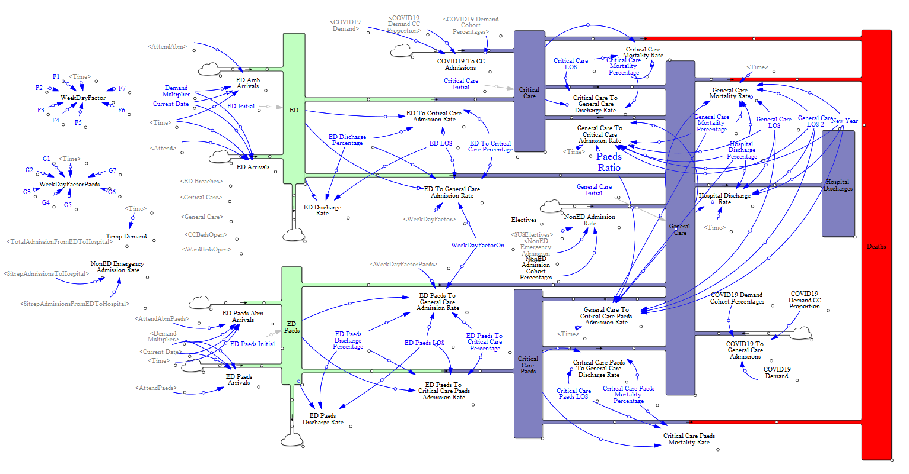

```{r setup, include=FALSE}
library(dplyr)
library(deSolve)
library(echarts4r)
library(tibble)
library(stringr)
library(purrr)
library(readxl)
library(DiagrammeR)
library(downloadthis)

knitr::opts_chunk$set(echo = TRUE)
options(scipen=999)
```

## About the model

The Winter Pressures Model was developed by the Judge Business School in collaboration with the Joint Evidence & Intelligence Cell and Public Health England in order to model scenarios of bed occupancy at an NHS Acute Trust level. The model was created in Vensim. In this document we will create a similar model using R. An image of the Vensim model can be seen below and models patients coming into a trust via the Emergency Department or as direct admissions, following through general and critical care beds, and then leaving the hospital as either discharges or deaths. The model treats minors, majors, and resuscitation patients differently.

> Important: The implementation of the Winter Pressures model in R is not an exact replica of the Vensim model and these results in this file should not be taken as outputs from the Vensim model.

The (fictional) data used for this projected can be downloaded here:

```{r echo=FALSE, warning=FALSE, message=FALSE}
downloadthis::download_this(read.csv("Winter Pressures/Winter_Pressures_Inputs_Actuals.csv"),
                            button_label = "Winter_Pressures_Inputs_Sim_Actuals",
                            output_name = "Winter_Pressures_Inputs_Actuals", output_extension = ".csv")
downloadthis::download_this(read.csv("Winter Pressures/Winter_Pressures_Starting_Parameters.csv"),
                            button_label = "Winter_Pressures_Starting_Parameters",
                            output_name = "Winter_Pressures_Starting_Parameters", output_extension = ".csv")
```

## Input data

To develop the model, we will use dataset which simulates the number of admissions and bed occupancy levels over a winter period.

```{r}
bed_data <- read.csv("Winter Pressures/Winter_Pressures_Inputs_Actuals.csv") %>%
  mutate(Date = as.Date(Date, format = "%d/%m/%Y"),
         Non_ED_Admi = ElectivesAdmi + NonEDEmergencyAdmissions,
         Non_ED_Admi_minors = Non_ED_Admi * 0.45, #assume that 45% of non-ED admissions are minors
         Non_ED_Admi_majors = Non_ED_Admi * 0.45, #assume that 45% of non-ED admissions are majors
         Non_ED_Admi_resus = Non_ED_Admi - (Non_ED_Admi_minors + Non_ED_Admi_majors))

# Check dates to ensure no duplicates, missing, and to add a time step variable
date_range <- seq(min(bed_data$Date, na.rm = T), max(bed_data$Date, na.rm = T), by = 1) 

paste("There are", sum(duplicated(bed_data$Date)), "duplicated dates,",
      sum(is.na(bed_data$Date)), "empty dates, and",
      length(date_range[!date_range %in% bed_data$Date]), "missing dates.")

bed_data <- mutate(bed_data, time_step = row_number())
```

## Visualising the model

The model developed by Judge Business School, visualised below, is more complex than the model we will create in R, but we can replicate the visualisation of the model.



We can use the `diagrammeR` package to visualise the model in R.

```{r}
grViz(
  "

digraph {

      graph [layout = dot,
       rankdir = LR]
      
      # Inputs
      
      node [shape = diamond]
      # fillcolor = PaleGreen, style = filled
      
      ED_Paeds_Amb_Arrivals [label = 'ED Paediatric Ambulatory Arrivals'] 
      ED_Paeds_Arrivals [label = 'ED Paediatric Arrivals']
      ED_Amb_Arrivals [label = 'ED Ambulatory Arrivals']
      ED_Arrivals [label = 'ED Arrivals']
      
      # Flows
      
      node [shape = none]
      
      ED_Discharge_Rate [label = 'ED Discharge Rate']
      ED_Discharge_Percentage [label = 'ED Discharge %']
      
      
      ED_Critical_Care_Admission_Rate [label = 'ED to Critical Care Admission Rate']
      Critical_Care_Mortality_Rate [label = 'Critical Care Mortality Rate']
      Critical_Care_Paeds_Mortality_Rate [label = 'Critical Care Paediatrics Mortality Rate']
      General_Care_Mortality_Rate [label = 'General Care Mortality Rate']
      Hospital_Discharge_Rate [label = 'Hospital Discharge Rate']
      
      
      
      ED_Paeds_General_Care_Admission_Rate [label = 'ED Paeds to General Care Admission Rate']
      ED_Paeds_Discharge_Rate [label = 'ED Discharge Rate - Paediatrics']
      ED_Paeds_Discharge_Percentage [label = 'ED Discharge % - Paediatrics']
      
      ED_LOS [label = 'ED Length of Stay']
      
      # ED
      
      {ED_Amb_Arrivals ED_Arrivals} -> ED [penwidth = 3]
      
      ED -> ED_Discharge_Rate -> ED_Discharge
      ED -> ED_Critical_Care_Admission_Rate -> Critical_Care
      ED -> ED_General_Care_Admission_Rate -> General_Care
      
      ED_Discharge_Percentage -> ED_Discharge_Rate
      ED_Discharge_Percentage -> ED_Critical_Care_Admission_Rate
      ED_Discharge_Percentage -> ED_General_Care_Admission_Rate
      
      ED_LOS -> {ED_Discharge_Rate;
                 ED_Critical_Care_Admission_Rate;
                 ED_General_Care_Admission_Rate}
      
      ED_Critical_Care_Percentage -> {ED_General_Care_Admission_Rate;
                                      ED_Critical_Care_Admission_Rate}
      
      {ED_Paeds_Amb_Arrivals; ED_Paeds_Arrivals} -> ED_Paeds [penwidth = 3]
      
      ED_Paeds -> ED_Paeds_Discharge_Rate -> ED_Discharge_Paeds [penwidth = 3]
      ED_Paeds -> ED_Paeds_Critical_Care_Admission_Rate -> Critical_Care_Paeds [penwidth = 3]
      ED_Paeds -> ED_Paeds_General_Care_Admission_Rate -> General_Care  [penwidth = 3]
      
      ED_Paeds_Discharge_Percentage -> {ED_Paeds_Discharge_Rate;
      ED_Paeds_Critical_Care_Admission_Rate;
      ED_Paeds_General_Care_Admission_Rate}
      
      ED_Paeds_LOS -> {ED_Paeds_Discharge_Rate;
                       ED_Paeds_Critical_Care_Admission_Rate;
                       ED_Paeds_General_Care_Admission_Rate}
      
      ED_Paeds_Critical_Care_Percentage -> {ED_Paeds_General_Care_Admission_Rate;
                                            ED_Paeds_Critical_Care_Admission_Rate}
      

      # Crits Care
      
      Critical_Care -> Critical_Care_Mortality_Rate -> Deaths
      Critical_Care -> General_Care
      
      Critical_Care_Mortality_Percentage -> Critical_Care_Mortality_Rate
      Critical_Care_Mortality_Percentage -> Critical_Care_General_Care_Discharge_Rate
      Critical_Care_LOS -> CriticalCare_Mortality_Rate
      Critical_Care_LOS -> Critical_Care_General_Care_Discharge_Rate
      Critical_Care_General_Care_Discharge_Rate -> General_Care [penwidth = 3]
      
    
      Critical_Care_Paeds -> Critical_Care_Paeds_Mortality_Rate -> Deaths [penwidth = 3]
      Critical_Care_Paeds -> Critical_Care_Paeds_General_Care_Discharge_Rate -> General_Care [penwidth = 3]
      
      Critical_Care_Paeds_Mortality_Percentage -> Critical_Care_Paeds_Mortality_Rate [penwidth = 3]
      Critical_Care_Paeds_Mortality_Percentage -> Critical_Care_Paeds_General_Care_Discharge_Rate [penwidth = 3]
      Critical_Care_Paeds_LOS -> CriticalCare_Paeds_Mortality_Rate [penwidth = 3]
      Critical_Care_Paeds_LOS -> Critical_Care_Paeds_General_Care_Discharge_Rate [penwidth = 3]
      
      
      
      # General Care
      
      General_Care -> Hospital_Discharge_Rate -> Hospital_Discharges [penwidth = 3]
      General_Care -> General_Care_Mortality_Rate -> Deaths [penwidth = 3]
      
      General_Care -> General_Care_Critical_Care_Discharge_Rate -> Critical_Care [penwidth = 3]
      General_Care -> General_Care_Critical_Care_Discharge_Rate_Paeds -> Critical_Care_Paeds [penwidth = 3]
      
    
      # Stocks
      
      
      ED [label = 'Emergency Department - General', fillcolor = PaleGreen, style = filled, shape = box];
      ED_Paeds [label = 'Emergency Department - Paediatrics', fillcolor = PaleGreen, style = filled, shape = box];
      
      
      Critical_Care [label = 'Critical Care', fillcolor = CornflowerBlue, style = filled, shape = box];
      Critical_Care_Paeds [label = 'Critical Care - Paediatrics', fillcolor = CornflowerBlue, style = filled, shape = box];
      
      General_Care [label = 'General Care', fillcolor = CornflowerBlue, style = filled, shape = box];
      
      Hospital_Discharges [label = 'Hospital Discharges', fillcolor = Yellow, style = filled, shape = box];
      
      ED_Discharge [label = 'ED Discharges - General', fillcolor = Yellow, style = filled, shape = box]
      
      ED_Discharge_Paeds [label = 'ED Discharges - Paediatrics', fillcolor = Yellow, style = filled, shape = box]
      
      Deaths [fillcolor = Red, style = filled, shape = box]
      
      # Rates
      
      General_Care_Critical_Care_Discharge_Rate [shape = oval]
      
      
      # WeekDayFactor
      
      WeekDayFactor [fontsize = 25]
      
  {F1 F2 F3 F4 F5 F6 F7} -> WeekDayFactor
  
      # WeekDayFactorPaeds
      
      WeekDayFactorPaeds [fontsize = 25]
      
  {G1 G2 G3 G4 G5 G6 G7} -> WeekDayFactorPaeds 
      
}
      ")
```

## Creating the model

First we can set up the parameters for the model, including the initial stocks, simulated time, and parameters for the flows. To reduce the amount of code we will run the model three times for minors, majors, and resus but it would be possible (though more duplicative) to run the model for all groups at the same time.

```{r class.source = 'fold-show'}
# Create time vector to run the model between. For each step the model is updated.
step <- 0.04
simtime <- seq(min(bed_data$time_step), max(bed_data$time_step), by = step)

# Create stocks vector, with initial values. It can be good practice to prefix all stocks with 's'
stocks_minors <- c(s_ED_Occupancy_adult = 20,
                   s_ED_Occupancy_paed = 1,
                   s_GB_Occupancy = 155,
                   s_CC_Occupancy = 5,
                   s_Discharges = 0,
                   s_Deaths = 0)

stocks_majors <- c(s_ED_Occupancy_adult = 10,
                   s_ED_Occupancy_paed = 1,
                   s_GB_Occupancy = 155,
                   s_CC_Occupancy = 5,
                   s_Discharges = 0,
                   s_Deaths = 0)

stocks_resus <- c(s_ED_Occupancy_adult = 0,
                  s_ED_Occupancy_paed = 0,
                  s_GB_Occupancy = 34,
                  s_CC_Occupancy = 0,
                  s_Discharges = 0,
                  s_Deaths = 0)

# Create auxiliaries vector, with values. It can be good practice to prefix all auxiliaries with 'a'
vemsim_optimal_aux <- read.csv("Winter Pressures/Winter_Pressures_Starting_Parameters.csv")

aux_minors <- vemsim_optimal_aux %>%
  filter(grepl("_Minors$", Code)) %>%
  select(Code, Value) %>%
  mutate(Code = paste0("a_", str_remove(Code, "_Minors"))) %>%
  deframe()

aux_majors <- vemsim_optimal_aux %>%
  filter(grepl("_Majors$", Code)) %>%
  select(Code, Value) %>%
  mutate(Code = paste0("a_", str_remove(Code, "_Majors"))) %>%
  deframe()

aux_resus <- vemsim_optimal_aux %>%
  filter(grepl("_Resus$", Code)) %>%
  select(Code, Value) %>%
  mutate(Code = paste0("a_", str_remove(Code, "_Resus"))) %>%
  deframe()
```

Next we can define the model.

```{r class.source = 'fold-show'}
model <- function(time, stocks, auxs){
  
  # Pass the existing stocks and auxiliaries
  with(as.list(c(stocks, auxs)), { 
    
    # Calculate the updated values 
    
    # Auxiliaries ------
    
    ## Exogenous inflows
    a_TotalAmbArrAdult <- ff_TotalAmbArrAdult(time)
    a_TotalNonAmbArrAdult <- ff_TotalNonAmbArrAdult(time)
    a_TotalAmbArrPaed <- ff_TotalAmbArrPead(time)
    a_TotalNonAmbArrPaed <- ff_TotalNonAmbArrPead(time)
    a_TotalNonEDAdmi <- ff_TotalNonEDAdmi(time)
    
    # Flows ------
    
    ## ED
    f_ED_to_GB_adult <- s_ED_Occupancy_adult * (1 - (a_ED_Discharge + a_ED_To_Critical_Care)) / a_ED_LOS
    f_ED_to_CC_adult <- s_ED_Occupancy_adult * a_ED_To_Critical_Care / a_ED_LOS
    f_ED_to_Dis_adult <- s_ED_Occupancy_adult * a_ED_Discharge / a_ED_LOS

    f_ED_to_GB_paed <- s_ED_Occupancy_paed * (1 - (a_ED_Paeds_Discharge + a_ED_Paeds_To_Critical_Care)) / a_ED_Paeds_LOS
    f_ED_to_CC_paed <- s_ED_Occupancy_paed * a_ED_Paeds_To_Critical_Care / a_ED_Paeds_LOS
    f_ED_to_Dis_paed <- s_ED_Occupancy_paed * a_ED_Paeds_Discharge / a_ED_Paeds_LOS

    ## GB
    f_GB_to_CC <- s_GB_Occupancy * (1 - (a_Hospital_Discharge + (1-a_Hospital_Discharge)*a_General_Care_Mortality)) / a_General_Care_LOS_2
    f_GB_to_Dis <- s_GB_Occupancy * a_Hospital_Discharge / a_General_Care_LOS_2
    f_GB_to_Mort <- s_GB_Occupancy *  (1-a_Hospital_Discharge)*a_General_Care_Mortality / a_General_Care_LOS_2

    ## CC
    f_CC_to_GB <- s_CC_Occupancy * (1 - a_Critical_Care_Mortality) / a_Critical_Care_LOS
    f_CC_to_Mort <- s_CC_Occupancy * a_Critical_Care_Mortality / a_Critical_Care_LOS

    # Integral of Stocks ------
    
    d_ED_Occupancy_adult <- (a_TotalAmbArrAdult + a_TotalNonAmbArrAdult) - (f_ED_to_GB_adult + f_ED_to_CC_adult + f_ED_to_Dis_adult)
    d_ED_Occupancy_paed <- (a_TotalAmbArrPaed + a_TotalNonAmbArrPaed) - (f_ED_to_GB_paed + f_ED_to_CC_paed + f_ED_to_Dis_paed)
    d_GB_Occupancy <- (f_CC_to_GB + f_ED_to_GB_adult + f_ED_to_GB_paed + a_TotalNonEDAdmi) - (f_GB_to_CC + f_GB_to_Dis + f_GB_to_Mort)
    d_CC_Occupancy <- (f_ED_to_CC_adult + f_ED_to_CC_paed + f_GB_to_CC) - (f_CC_to_GB + f_CC_to_Mort)
    d_Discharges <- f_ED_to_Dis_adult + f_ED_to_Dis_paed + f_GB_to_Dis
    d_Deaths <- f_CC_to_Mort + f_GB_to_Mort
    
    # Return the new results ------
    return(list(c(d_ED_Occupancy_adult, d_ED_Occupancy_paed, d_GB_Occupancy, d_CC_Occupancy, d_Discharges, d_Deaths),
                TotalAmbArrAdult = a_TotalAmbArrAdult,
                TotalNonAmbArrAdult = a_TotalNonAmbArrAdult,
                TotalAmbArrPaed = a_TotalAmbArrPaed,
                TotalNonAmbArrPaed = a_TotalNonAmbArrPaed,
                ED_to_GB_adult = f_ED_to_GB_adult,
                ED_to_CC_adult = f_ED_to_CC_adult,
                ED_to_Dis_adult = f_ED_to_Dis_adult,
                ED_to_GB_paed = f_ED_to_GB_paed,
                ED_to_CC_paed = f_ED_to_CC_paed,
                ED_to_Dis_paed = f_ED_to_Dis_paed,
                TotalNonEDAdmi = a_TotalNonEDAdmi,
                GB_to_CC = f_GB_to_CC,
                GB_to_Dis = f_GB_to_Dis,
                GB_to_Mort = f_GB_to_Mort,
                CC_to_GB = f_CC_to_GB,
                CC_to_Mort = f_CC_to_Mort))
    
  })
}
```

We can then run the model for minors, majors, and resus using the different parameters for each group.

```{r class.source = 'fold-show'}
## Change to use minors
ff_TotalAmbArrAdult <- bed_data %>% select(time_step, AmbArrMinorsAdult) %>% approxfun(rule = 2)
ff_TotalNonAmbArrAdult <- bed_data %>% select(time_step, NonAmbArrMinorsAdult) %>% approxfun(rule = 2)
ff_TotalAmbArrPead <- bed_data %>% select(time_step, AmbArrMinorsPaeds) %>% approxfun(rule = 2)
ff_TotalNonAmbArrPead <- bed_data %>% select(time_step, NonAmbArrMinorsPaeds) %>% approxfun(rule = 2)
ff_TotalNonEDAdmi <- bed_data %>% select(time_step, Non_ED_Admi_minors) %>% approxfun(rule = 2)

results_minors <- data.frame(ode(y = stocks_minors, times = simtime, func = model, 
                                parms = aux_minors, method = "euler"))

## Change to use majors
ff_TotalAmbArrAdult <- bed_data %>% select(time_step, AmbArrMajorsAdult) %>% approxfun(rule = 2)
ff_TotalNonAmbArrAdult <- bed_data %>% select(time_step, NonAmbArrMajorsAdult) %>% approxfun(rule = 2)
ff_TotalAmbArrPead <- bed_data %>% select(time_step, AmbArrMajorsPaeds) %>% approxfun(rule = 2)
ff_TotalNonAmbArrPead <- bed_data %>% select(time_step, NonAmbArrMajorsPaeds) %>% approxfun(rule = 2)
ff_TotalNonEDAdmi <- bed_data %>% select(time_step, Non_ED_Admi_majors) %>% approxfun(rule = 2)

results_majors <- data.frame(ode(y = stocks_majors, times = simtime, func = model, 
                                parms = aux_majors, method = "euler"))

## Change to use resus
ff_TotalAmbArrAdult <- bed_data %>% select(time_step, AmbArrResusAdult) %>% approxfun(rule = 2)
ff_TotalNonAmbArrAdult <- bed_data %>% select(time_step, NonAmbArrResusAdult) %>% approxfun(rule = 2)
ff_TotalAmbArrPead <- bed_data %>% select(time_step, AmbArrResusPaeds) %>% approxfun(rule = 2)
ff_TotalNonAmbArrPead <- bed_data %>% select(time_step, NonAmbArrResusPaeds) %>% approxfun(rule = 2)
ff_TotalNonEDAdmi <- bed_data %>% select(time_step, Non_ED_Admi_resus) %>% approxfun(rule = 2)

results_resus <- data.frame(ode(y = stocks_resus, times = simtime, func = model, 
                                parms = aux_resus, method = "euler"))
```

## Outputs

Now the model has been run we can visualise the results and compare to actual values

```{r class.source = 'fold-show'}
times_to_dates <- data.frame(time = seq(min(simtime), max(simtime), by = 1)) %>%
  mutate(dates = min(bed_data$Date) + row_number() - 1)

clean_minors <- results_minors %>%
  filter(time %% 1 == 0) %>%
  left_join(times_to_dates, by = c("time"="time"), na_matches = "never") %>%
  rename_with( ~ paste0(.x, "_minors"))

clean_majors <- results_majors %>%
  filter(time %% 1 == 0) %>%
  left_join(times_to_dates, by = c("time"="time"), na_matches = "never") %>%
  rename_with( ~ paste0(.x, "_majors"))

clean_resus <- results_resus %>%
  filter(time %% 1 == 0) %>%
  left_join(times_to_dates, by = c("time"="time"), na_matches = "never") %>%
  rename_with( ~ paste0(.x, "_resus"))

sitrep_results <- bed_data %>%
  select(Date, WardBedsOccupied, CCBedsOccupied) %>%
  mutate(Date = as.Date(Date))

clean_results <- left_join(clean_minors, clean_majors, by = c("dates_minors"="dates_majors"), na_matches = "never") %>%
  left_join(clean_resus, by = c("dates_minors"="dates_resus"), na_matches = "never") %>%
  mutate(Total_GB_Occupancy = s_GB_Occupancy_minors + s_GB_Occupancy_majors + s_GB_Occupancy_resus,
         Total_CC_Occupancy = s_CC_Occupancy_minors + s_CC_Occupancy_majors + s_CC_Occupancy_resus) %>%
  left_join(sitrep_results, by = c("dates_minors"="Date"), na_matches = "never")
  
clean_results %>%
  e_chart(dates_minors) %>%
  e_line(Total_GB_Occupancy, color = "green", name = "GB Modelled") %>%
  e_line(WardBedsOccupied, color = "lightgreen", name = "GB Actual") %>%
  e_line(Total_CC_Occupancy, color = "blue", name = "CC Modelled") %>%
  e_line(CCBedsOccupied, color = "lightblue", name = "CC Actual") %>%
  e_tooltip('axis')
```

## Future scenarios

Now we have an idea of accurate parameters and flows we can start to simulate how the system would have been different with different policies (e.g. if length of stay was reduced or increased by a day how many beds would be required) as well as future planning (e.g. if admissions increase by 10% what would the occupancy be).

### **Simulating** parameter changes

It is often easiest to store parameters in an external file, especially when there are many of them. In this case we have three scenarios: a base with the default general bed length of stay (LOS) and an increased LOS scenario which models what happens if people spend an extra day in general beds.

```{r}
# Read in the parameters stored in params.xlsx
custom_params <- excel_sheets("Winter Pressures/Params.xlsx") %>% 
  set_names() %>% 
  map(read_excel, path = "Winter Pressures/Params.xlsx")

read_named_vector <- function(sheet, scenario) {
  extract <- (custom_params[[sheet]] %>% filter(Scenario == scenario))[,-1]
  as.numeric(extract) %>% set_names(names(extract))
}

scenarios <- c("base", "increase_los")
scenario <- list()

for(i in scenarios) {

  # Note to make examples clear this code is not functionised but this would be good practice
  
  stocks_minors <- read_named_vector("Stocks - Minors", i)
  stocks_majors <- read_named_vector("Stocks - Minors", i)
  stocks_resus <- read_named_vector("Stocks - Minors", i)
  aux_majors <- read_named_vector("Auxillaries - Minors", i)
  aux_minors <- read_named_vector("Auxillaries - Majors", i)
  aux_resus <- read_named_vector("Auxillaries - Resus", i)
  
  ## Change to use minors
  ff_TotalAmbArrAdult <- bed_data %>% select(time_step, AmbArrMinorsAdult) %>% approxfun(rule = 2)
  ff_TotalNonAmbArrAdult <- bed_data %>% select(time_step, NonAmbArrMinorsAdult) %>% approxfun(rule = 2)
  ff_TotalAmbArrPead <- bed_data %>% select(time_step, AmbArrMinorsPaeds) %>% approxfun(rule = 2)
  ff_TotalNonAmbArrPead <- bed_data %>% select(time_step, NonAmbArrMinorsPaeds) %>% approxfun(rule = 2)
  ff_TotalNonEDAdmi <- bed_data %>% select(time_step, Non_ED_Admi_minors) %>% approxfun(rule = 2)
  
  results_minors <- data.frame(ode(y = stocks_minors, times = simtime, func = model, 
                                  parms = aux_minors, method = "euler"))
  
  ## Change to use majors
  ff_TotalAmbArrAdult <- bed_data %>% select(time_step, AmbArrMajorsAdult) %>% approxfun(rule = 2)
  ff_TotalNonAmbArrAdult <- bed_data %>% select(time_step, NonAmbArrMajorsAdult) %>% approxfun(rule = 2)
  ff_TotalAmbArrPead <- bed_data %>% select(time_step, AmbArrMajorsPaeds) %>% approxfun(rule = 2)
  ff_TotalNonAmbArrPead <- bed_data %>% select(time_step, NonAmbArrMajorsPaeds) %>% approxfun(rule = 2)
  ff_TotalNonEDAdmi <- bed_data %>% select(time_step, Non_ED_Admi_majors) %>% approxfun(rule = 2)
  
  results_majors <- data.frame(ode(y = stocks_majors, times = simtime, func = model, 
                                  parms = aux_majors, method = "euler"))
  
  ## Change to use resus
  ff_TotalAmbArrAdult <- bed_data %>% select(time_step, AmbArrResusAdult) %>% approxfun(rule = 2)
  ff_TotalNonAmbArrAdult <- bed_data %>% select(time_step, NonAmbArrResusAdult) %>% approxfun(rule = 2)
  ff_TotalAmbArrPead <- bed_data %>% select(time_step, AmbArrResusPaeds) %>% approxfun(rule = 2)
  ff_TotalNonAmbArrPead <- bed_data %>% select(time_step, NonAmbArrResusPaeds) %>% approxfun(rule = 2)
  ff_TotalNonEDAdmi <- bed_data %>% select(time_step, Non_ED_Admi_resus) %>% approxfun(rule = 2)
  
  results_resus <- data.frame(ode(y = stocks_resus, times = simtime, func = model, 
                                  parms = aux_resus, method = "euler"))
  
  times_to_dates <- data.frame(time = seq(min(simtime), max(simtime), by = 1)) %>%
    mutate(dates = min(bed_data$Date) + row_number() - 1)

  clean_minors <- results_minors %>%
    filter(time %% 1 == 0) %>%
    left_join(times_to_dates, by = c("time"="time"), na_matches = "never") %>%
    rename_with( ~ paste0(.x, "_minors"))
  
  clean_majors <- results_majors %>%
    filter(time %% 1 == 0) %>%
    left_join(times_to_dates, by = c("time"="time"), na_matches = "never") %>%
    rename_with( ~ paste0(.x, "_majors"))
  
  clean_resus <- results_resus %>%
    filter(time %% 1 == 0) %>%
    left_join(times_to_dates, by = c("time"="time"), na_matches = "never") %>%
    rename_with( ~ paste0(.x, "_resus"))
  
  sitrep_results <- bed_data %>%
    select(Date, WardBedsOccupied, CCBedsOccupied) %>%
    mutate(Date = as.Date(Date))
  
  scenario[[i]] <- left_join(clean_minors, clean_majors, by = c("dates_minors"="dates_majors"), na_matches = "never") %>%
    left_join(clean_resus, by = c("dates_minors"="dates_resus"), na_matches = "never") %>%
    mutate(Total_GB_Occupancy = s_GB_Occupancy_minors + s_GB_Occupancy_majors + s_GB_Occupancy_resus,
           Total_CC_Occupancy = s_CC_Occupancy_minors + s_CC_Occupancy_majors + s_CC_Occupancy_resus) %>%
    left_join(sitrep_results, by = c("dates_minors"="Date"), na_matches = "never")

}

plot_1 <- scenario[[scenarios[1]]] %>%
  e_chart(dates_minors, elementId = "chart1") %>%
  e_line(Total_GB_Occupancy, color = "green", name = "GB Modelled") %>%
  e_line(WardBedsOccupied, color = "lightgreen", name = "GB Actual") %>%
  e_line(Total_CC_Occupancy, color = "blue", name = "CC Modelled") %>%
  e_line(CCBedsOccupied, color = "lightblue", name = "CC Actual") %>%
  e_tooltip('axis') %>%
  e_title(paste(scenarios[1], "scenario")) %>%
  e_legend(top = "bottom")

plot_2 <- scenario[[scenarios[2]]] %>%
  e_chart(dates_minors, elementId = "chart2") %>%
  e_line(Total_GB_Occupancy, color = "green", name = "GB Modelled") %>%
  e_line(WardBedsOccupied, color = "lightgreen", name = "GB Actual") %>%
  e_line(Total_CC_Occupancy, color = "blue", name = "CC Modelled") %>%
  e_line(CCBedsOccupied, color = "lightblue", name = "CC Actual") %>%
  e_tooltip('axis') %>%
  e_title(paste(scenarios[2], "scenario")) %>%
  e_legend(top = "bottom") %>%
  e_connect(c("chart1", "chart2"))

e_arrange(plot_1, plot_2, cols = 2)

```

### Simulating future scenarios

This document won't go over forecasting future admissions as it is significant topic in its own right. Instead, we will model a simple forecast by taking randomly sampling past days, increasing the result by 10%, and feeding this into the model to assess how this changes occupancy. We will do for 30 days into the future.

```{r}
# Created projected data frame
bed_data_projected <- data.frame(
  Date = seq(max(bed_data$Date, na.rm = T) + 1, max(bed_data$Date, na.rm = T) + 30, by = 1),
  AmbArrMinorsAdult = sample(bed_data$AmbArrMinorsAdult, 30) * 1.1,
  NonAmbArrMinorsAdult = sample(bed_data$NonAmbArrMinorsAdult, 30) * 1.1,
  AmbArrMinorsPaeds = sample(bed_data$AmbArrMinorsPaeds, 30) * 1.1,
  NonAmbArrMinorsPaeds = sample(bed_data$NonAmbArrMinorsPaeds, 30) * 1.1,
  Non_ED_Admi_minors = sample(bed_data$Non_ED_Admi_minors, 30) * 1.1,
  AmbArrMajorsAdult = sample(bed_data$AmbArrMajorsAdult, 30) * 1.1,
  NonAmbArrMajorsAdult = sample(bed_data$NonAmbArrMajorsAdult, 30) * 1.1,
  AmbArrMajorsPaeds = sample(bed_data$AmbArrMajorsPaeds, 30) * 1.1,
  NonAmbArrMajorsPaeds = sample(bed_data$NonAmbArrMajorsPaeds, 30) * 1.1,
  Non_ED_Admi_majors = sample(bed_data$Non_ED_Admi_majors, 30) * 1.1,
  AmbArrResusAdult = sample(bed_data$AmbArrResusAdult, 30) * 1.1,
  NonAmbArrResusAdult = sample(bed_data$NonAmbArrResusAdult, 30) * 1.1,
  AmbArrResusPaeds = sample(bed_data$AmbArrResusPaeds, 30) * 1.1,
  NonAmbArrResusPaeds = sample(bed_data$NonAmbArrResusPaeds, 30) * 1.1,
  Non_ED_Admi_resus = sample(bed_data$Non_ED_Admi_resus, 30) * 1.1,
  time_step = seq(max(bed_data$time_step, na.rm = T) + 1, max(bed_data$time_step, na.rm = T) + 30, by = 1)) %>%
  bind_rows(bed_data, .)

# Update simulation times
step <- 0.04
simtime <- seq(min(bed_data_projected$time_step), max(bed_data_projected$time_step), by = step)

# Run the model for each population
## Change to use minors
ff_TotalAmbArrAdult <- bed_data_projected %>% select(time_step, AmbArrMinorsAdult) %>% approxfun(rule = 2)
ff_TotalNonAmbArrAdult <- bed_data_projected %>% select(time_step, NonAmbArrMinorsAdult) %>% approxfun(rule = 2)
ff_TotalAmbArrPead <- bed_data_projected %>% select(time_step, AmbArrMinorsPaeds) %>% approxfun(rule = 2)
ff_TotalNonAmbArrPead <- bed_data_projected %>% select(time_step, NonAmbArrMinorsPaeds) %>% approxfun(rule = 2)
ff_TotalNonEDAdmi <- bed_data_projected %>% select(time_step, Non_ED_Admi_minors) %>% approxfun(rule = 2)

results_minors <- data.frame(ode(y = stocks_minors, times = simtime, func = model, 
                                parms = aux_minors, method = "euler"))

## Change to use majors
ff_TotalAmbArrAdult <- bed_data_projected %>% select(time_step, AmbArrMajorsAdult) %>% approxfun(rule = 2)
ff_TotalNonAmbArrAdult <- bed_data_projected %>% select(time_step, NonAmbArrMajorsAdult) %>% approxfun(rule = 2)
ff_TotalAmbArrPead <- bed_data_projected %>% select(time_step, AmbArrMajorsPaeds) %>% approxfun(rule = 2)
ff_TotalNonAmbArrPead <- bed_data_projected %>% select(time_step, NonAmbArrMajorsPaeds) %>% approxfun(rule = 2)
ff_TotalNonEDAdmi <- bed_data_projected %>% select(time_step, Non_ED_Admi_majors) %>% approxfun(rule = 2)

results_majors <- data.frame(ode(y = stocks_majors, times = simtime, func = model, 
                                parms = aux_majors, method = "euler"))

## Change to use resus
ff_TotalAmbArrAdult <- bed_data_projected %>% select(time_step, AmbArrResusAdult) %>% approxfun(rule = 2)
ff_TotalNonAmbArrAdult <- bed_data_projected %>% select(time_step, NonAmbArrResusAdult) %>% approxfun(rule = 2)
ff_TotalAmbArrPead <- bed_data_projected %>% select(time_step, AmbArrResusPaeds) %>% approxfun(rule = 2)
ff_TotalNonAmbArrPead <- bed_data_projected %>% select(time_step, NonAmbArrResusPaeds) %>% approxfun(rule = 2)
ff_TotalNonEDAdmi <- bed_data_projected %>% select(time_step, Non_ED_Admi_resus) %>% approxfun(rule = 2)

results_resus <- data.frame(ode(y = stocks_resus, times = simtime, func = model, 
                                parms = aux_resus, method = "euler"))

times_to_dates <- data.frame(time = seq(min(simtime), max(simtime), by = 1)) %>%
  mutate(dates = min(bed_data_projected$Date) + row_number() - 1)

clean_minors <- results_minors %>%
  filter(time %% 1 == 0) %>%
  left_join(times_to_dates, by = c("time"="time"), na_matches = "never") %>%
  rename_with( ~ paste0(.x, "_minors"))

clean_majors <- results_majors %>%
  filter(time %% 1 == 0) %>%
  left_join(times_to_dates, by = c("time"="time"), na_matches = "never") %>%
  rename_with( ~ paste0(.x, "_majors"))

clean_resus <- results_resus %>%
  filter(time %% 1 == 0) %>%
  left_join(times_to_dates, by = c("time"="time"), na_matches = "never") %>%
  rename_with( ~ paste0(.x, "_resus"))

sitrep_results <- bed_data %>%
  select(Date, WardBedsOccupied, CCBedsOccupied) %>%
  mutate(Date = as.Date(Date))

clean_results <- left_join(clean_minors, clean_majors, by = c("dates_minors"="dates_majors"), na_matches = "never") %>%
  left_join(clean_resus, by = c("dates_minors"="dates_resus"), na_matches = "never") %>%
  mutate(Total_GB_Occupancy = s_GB_Occupancy_minors + s_GB_Occupancy_majors + s_GB_Occupancy_resus,
         Total_CC_Occupancy = s_CC_Occupancy_minors + s_CC_Occupancy_majors + s_CC_Occupancy_resus) %>%
  left_join(sitrep_results, by = c("dates_minors"="Date"), na_matches = "never")
  
clean_results %>%
  e_chart(dates_minors) %>%
  e_line(Total_GB_Occupancy, color = "green", name = "GB Modelled") %>%
  e_line(WardBedsOccupied, color = "lightgreen", name = "GB Actual") %>%
  e_line(Total_CC_Occupancy, color = "blue", name = "CC Modelled") %>%
  e_line(CCBedsOccupied, color = "lightblue", name = "CC Actual") %>%
  e_tooltip('axis')
```
